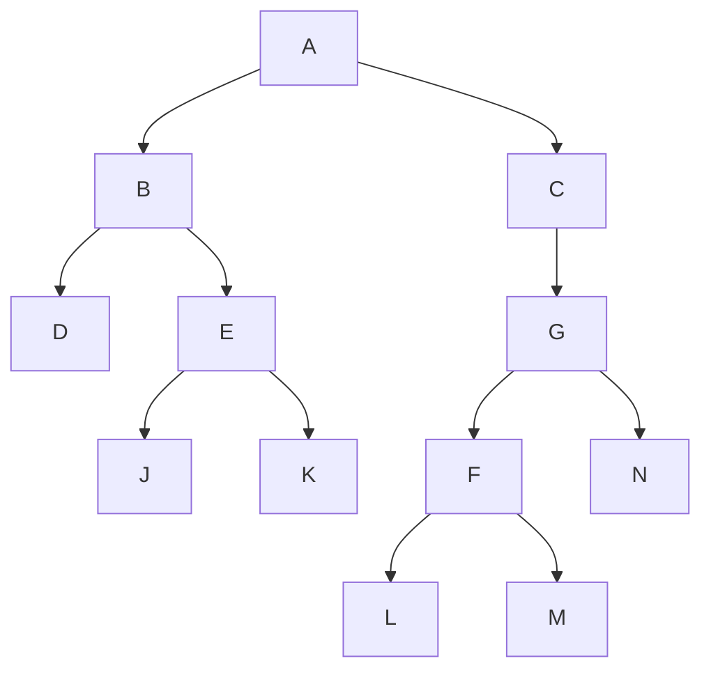

#### [547.朋友圈](https://leetcode-cn.com/problems/friend-circles/)

班上有 N 名学生。其中有些人是朋友，有些则不是。他们的友谊具有是传递性。如果已知 A 是 B 的朋友，B 是 C 的朋友，那么我们可以认为 A 也是 C 的朋友。所谓的朋友圈，是指所有朋友的集合。

给定一个 N * N 的矩阵 M，表示班级中学生之间的朋友关系。如果$M[i][j] = 1$，表示已知第 i 个和 j 个学生互为朋友关系，否则为不知道。你必须输出所有学生中的已知的朋友圈总数。


**示例 1：**

```
输入：
[[1,1,0],
 [1,1,0],
 [0,0,1]]
输出：2 
解释：已知学生 0 和学生 1 互为朋友，他们在一个朋友圈。
第2个学生自己在一个朋友圈。所以返回 2 。
```

**示例 2：**

```
输入：
[[1,1,0],
 [1,1,1],
 [0,1,1]]
输出：1
解释：已知学生 0 和学生 1 互为朋友，学生 1 和学生 2 互为朋友，所以学生 0 和学生 2 也是朋友，所以他们三个在一个朋友圈，返回 1 。
```

**提示：**

- $1 <= N <= 200$
- $M[i][j] == 1$
- $M[i][j] == M[j][i]$

**个人分析(DFS深度优先搜索):**

DFS 深度优先搜索:



上面的顺序

```bash
从左边开始
1. A - B - D
2. E - J
3. K
左边结束

右边开始
1. A - C - G - F - L
2. M
3. N
```


```bash
3 个学生的关系，1为朋友，0不是朋友
	j 	j 	j
i [[1,  1,   0],
i  [1,  1,   1],
i  [0,  1,   1]]

A, B, C 三个朋友之间的关系,AA表示自己跟自己的关系
[[AA, AB,  AC],
 [BA, BB,  BC],
 [CA, CB,  CC]]
```


**C ++ 实现**

```c++
#include <iostream>
#include <vector>

using namespace std;

class Solution {
    void dfs(vector<vector<int>>& M, vector<int> & visited, int i)
    {
        
		for(int j = 0; j < M.size(); ++j)
		{
			if(M[i][j] == 1 && visited[j] == 0)
			{
                visited[i] = 1;
				dfs(M, visited, j);
			}
		}
    }
public:
    int findCircleNum(vector<vector<int>>& M) {
        int count = 0;
        vector<int> visited(M.size());
        for(int i = 0; i < M.size(); ++i)
        {
        	if(visited[i] == 0)
        	{
        		dfs(M, visited, i);
        		++count;
        	}
        }
        return count;
    }
};

int main()
{
    Solution s;
    vector<vector<int>> M = {{1, 1, 0}, {1, 1, 1}, {0, 1, 1}};
    cout << s.findCircleNum(M) << endl;
    vector<vector<int>> M1 = {{1, 1, 0}, {1, 1, 0}, {0, 0, 1}};
    cout << s.findCircleNum(M1) << endl;
    return 0;
}
```

