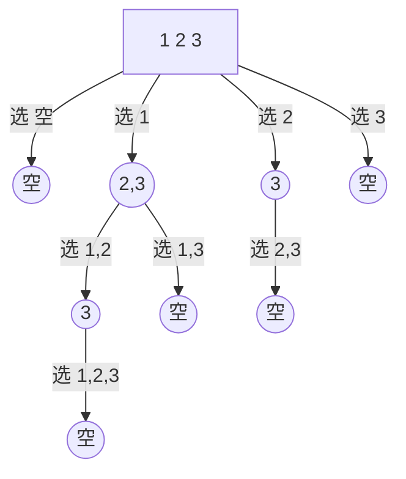

#### [78_子集](https://leetcode-cn.com/problems/subsets/)

给定一组不含重复元素的整数数组 nums，返回该数组所有可能的子集（幂集）。

说明：解集不能包含重复的子集。

示例:

```
输入: nums = [1,2,3]
输出:
[
  [3],
  [1],
  [2],
  [1,2,3],
  [1,3],
  [2,3],
  [1,2],
  []
]
```

**个人分析回溯算法 ： **

回溯算法：

当问题需要 **“回头”**, 要查找所有的解的时候，使用回溯算法。

满足结束条件，不是正确路径，走不通。要撤销选择，回退到上一个状态，继续尝试，直到找出所有解。

1. 画出递归树，找到状态变量（回溯函数的参数）
2. 依据需求，确定结束条件
3. 找出选择列表，与第一步紧密相关
4. 判断是否需要剪枝
5. 作出选择，递归调用，进入下一层
6. 撤销选择


#### 递归数

子集，不含重复元素的整数数组，返回该数组所有可能的子集。



观察上图可得，选择列表里的数，文本箭头里的 选 1， 选 2 ， 选3 等

比如：

**选1 : ** 这条路径，后面的选择列表只有 "2、3"，

**选2 : ** 这条路径，后面只有 "3" 这个选择，

那么这个时候，就应该使用一个参数start，来标识当前的选择列表的起始位置。

也就是标识每一层的状态，因此被形象的称为"状态变量"。

上面的path就是上面，选1，选2，选1,2， 选2,3等。

```c++
//nums为题目中的给的数组
//path为路径结果，要把每一条 path 加入结果集
void backtrack(vector<int>nums,vector<int>&path,int start)
```

#### 找结束条件

此题非常特殊，所有路径都应该加入结果集，所以不存在结束条件。或者说当 start 参数越过数组边界的时候，程序就自己跳过下一层递归了，因此不需要手写结束条件,直接加入结果集

```c++
// res为结果集，是全局变量vector<vector<int>>res,到时候要返回的
res.push_back(path);//把每一条路径加入结果集
```

#### 找选择列表

在递归数图，中已经提到过了，子集问题的选择列表，是上一条选择路径之后的数,即

```c++
for(int i=start;i<nums.size();i++)
```


#### 判断是否需要剪枝

从递归树中看到，路径没有重复的，也没有不符合条件的，所以不需要剪枝


#### 撤销选择

```c++
path.pop_back();
```


#### 做出选择(即for 循环里面的)

```c++
void backtrack(vector<int>nums,vector<int>&path,int start)
{
    for(int i=start;i<nums.size();i++)
    {
    	//做出选择
        path.push_back(nums[i]);
        //递归进入下一层，注意i+1，标识下一个选择列表的开始位置，最重要的一步
        backtrack(nums,path,i+1);
    }
}
```


#### **C++实现：**

```c++
#include <iostream>
#include <vector>
using namespace std;

class Solution {
public:
    vector<vector<int>> res;
    vector<int> path;
    int cur = 0;
    void backtrack(vector<int>nums,vector<int>&path,int start)
    {
        res.push_back(path);
        for(int i=start;i<nums.size();i++)
        {
            path.push_back(nums[i]);
            backtrack(nums,path,i+1);
            path.pop_back();
        }
    }
    vector<vector<int>> subsets(vector<int>& nums) {
        backtrack(nums, path, cur);
        return res;
    }
};

int main()
{
    Solution s;
    vector<int> nums = {1, 2, 3};
    vector<vector<int>> res = s.subsets(nums);
    cout << res.size() << endl;

    for (int i = 0; res.size(); i++){
        for (int j = 0; j < res[i].size(); j++){
            cout << res[i][j] << endl;
        }
    }
    return 0;
}
```


