[TOC]

## **[猜数字大小](https://leetcode-cn.com/problems/guess-number-higher-or-lower/)**

### 题目

猜数字游戏的规则如下：

- 每轮游戏，我都会从 1 到 n 随机选择一个数字。 请你猜选出的是哪个数字。
- 如果你猜错了，我会告诉你，你猜测的数字比我选出的数字是大了还是小了。

你可以通过调用一个预先定义好的接口 `int guess(int num)` 来获取猜测结果，返回值一共有 3 种可能的情况（`-1`，`1` 或 `0`）：

- -1：我选出的数字比你猜的数字小 `pick < num`
- 1 ：我选出的数字比你猜的数字大  `pick > num`
- 0 ：我选出的数字和你猜的数字一样。恭喜！你猜对了！`pick == num`

示例1 :

```
输入: n = 10, pick = 0
输出: 6
```

示例2 :

```
输入: n = 1, pick = 1
输出: 1
```

示例3

```
输入：n = 2, pick = 1
输出：1
```

示例 4 :

```
输入：n = 2, pick = 2
输出：2
```

**提示：**

- 1 <= n <= $2^{31}$ - 1
- 1 <= pick <= n

### 二分查找:

- 1-n 每次从中间猜起

- 返回 -1， 大了，往右边找： low = mid + 1

- 返回 1， 小了，往左边找： height = mid - 1
- 结束的条件: low <= height

low = 1,  height = n

中间的值，low是某个范围开始的位置, (height - low) /2是范围中间的值，要从头找到它的位置，得加low

mid = low + (height - low) / 2

### 复杂度分析

- 时间复杂度：  $O(log_2n)$ 为二分查找的时间复杂度。
- 空间复杂度： $O(1)$ 没有使用额外的空间。

### C++ 实现

```c++
#include <iostream>

using namespace std;

int guess(int num)
{
    if (num == 6){
        return 0;
    }
    if (num > 6){
        return -1;
    }
    if (num < 6){
        return 1;
    }
}

class Solution {
public:
    int guessNumber(int n) {
        int low = 1;
        int height = n;
        int mid;
        int res;
        while (low <= height){
            mid = low + (height - low) / 2;
            res = guess(mid);
            if (res == 0) return mid;
            // 小了，往左边找
            else if(res == -1) height = mid - 1;
            // 大了，往右边找
            else low = mid + 1;
        }
        return -1;
    }
};

int main()
{
    Solution s;
    cout << s.guessNumber(10) << endl;
}
```

### Python 实现:

```python
def guess(num):
    if num == 6: return 0
    if num > 6:  return -1
    if num < 6:  return 1

class Solution:
    def guessNumber(self, n: int) -> int:
        low = 1
        height = n
        while low <= height:
            mid = low + (height - low) // 2
            res = guess(mid)
            if res == 0: return mid
            elif res == -1: height = mid - 1
            else: low = mid + 1
        return -1
if __name__ == "__main__":
    s = Solution()
    print(s.guessNumber(10))
```


## **[分发饼干](https://leetcode-cn.com/problems/assign-cookies/)**

### 题目

- 假设你是一位很棒的家长，想要给你的孩子们一些小饼干。

- 但是，每个孩子最多只能给一块饼干。

- 对每个孩子`i`，都有一个胃口值 `g[i] `，这是能让孩子们满足胃口的饼干的最小尺寸；

- 并且每块饼干` j `，都有一个尺寸 `s[j]` 。

- 如果 `s[j] >= g[i]`，我们可以将这个饼干 `j `分配给孩子 `i` ，这个孩子会得到满足。

- 你的目标是尽可能满足越多数量的孩子，并输出这个最大数值。

示例 1:

```
输入: g = [1,2,3], s = [1,1]
输出: 1
解释: 
你有三个孩子和两块小饼干，3个孩子的胃口值分别是：1,2,3。
虽然你有两块小饼干，由于他们的尺寸都是 1，你只能让胃口值是1的孩子满足。
所以你应该输出 1。
```

示例 2:

```
输入: g = [1,2], s = [1,2,3]
输出: 2
解释: 
你有两个孩子和三块小饼干，2个孩子的胃口值分别是1,2。
你拥有的饼干数量和尺寸都足以让所有孩子满足。
所以你应该输出2.
```

**提示：**

- $1 <= g.length <= 3 * 10^4$
- $0 <= s.length <= 3 * 10^4$
- $1 <= g[i], s[j] <= 2^{31} - 1$

### 贪心算法： 

异常判断

给一个孩子的饼干应该是尽量小，先排序饼干，从小到大。这样满足度最小的孩子，最容易满足，先满足最小的孩子。


### 复杂度分析

时间复杂度：$O(G logG+SlogS)$
空间复杂度：$O(logG+logS)$


### c++ 实现

```c++
#include <iostream>
#include <algorithm>
#include <math.h>
#include <vector>

using namespace std;

class Solution {
public:
    int findContentChildren(vector<int>& g, vector<int>& s) {
        // 异常判断
        if (g.size() == 0 || s.size() == 0
            || g.size() > 3 * pow(10, 4)
            || s.size() > 3 * pow(10, 4))
            return 0;

        sort(g.begin(), g.end());
        sort(s.begin(), s.end());
        int gi = 0;
        int si = 0;
        while (g.size() > gi && s.size() > si)
        {
            if (s[si] >= g[gi])
                gi++;
            si++;
        }
        return gi;
    }
};

int main()
{
    Solution ss;
    vector<int> g = {1,2,3};
    vector<int> s = {1,1};
    cout << ss.findContentChildren(g, s) << endl;
    vector<int> g1 = {1,2};
    vector<int> s1 = {1,2,3};
    cout << ss.findContentChildren(g1, s1) << endl;
    return 0;
}
```

### python 实现

```python
class Solution:
    def findContentChildren(self, g, s) -> int:
        if len(g) == 0 or len(s) == 0:
            return 0

        sorted(g)
        sorted(s)
        gi = 0
        si = 0
        while (len(g) > gi and len(s) > si):
            if s[si] >= g[gi]:
                gi += 1
            si += 1
        return gi


if __name__ == "__main__":
    SS = Solution()
    g = [1,2,3]
    s = [1,1]
    print(SS.findContentChildren(g,s))
    g1 = [1,2]
    s1 = [1,2,3]
    print(SS.findContentChildren(g1,s1))
```


## **[H指数II](https://leetcode-cn.com/problems/h-index-ii/)**

### 题目

给定一位研究者论文被引用次数的数组（被引用次数是非负整数），数组已经按照 升序排列 。编写一个方法，计算出研究者的 h 指数。

`h 指数的定义: ` “h 代表“高引用次数”（high citations），一名科研人员的 h 指数是指他（她）的 （N 篇论文中）总共有 h 篇论文分别被引用了至少 h 次。（其余的 N - h 篇论文每篇被引用次数不多于 h 次。）"

示例:

```bash
输入: citations = [0,1,3,5,6]
输出: 3
解释: 给定数组表示研究者总共有 5 篇论文，每篇论文相应的被引用了 0, 1, 3, 5, 6 次。
    由于研究者有 3 篇论文每篇至少被引用了 3 次，其余两篇论文每篇被引用不多于 3 次，所以她的 h 指数是 3。
```

**说明:**

如果 h 有多有种可能的值 ，h 指数是其中最大的那个。 

**进阶:**

这是 H 指数 的延伸题目，本题中的 citations 数组是保证有序的。
你可以优化你的算法到对数时间复杂度吗？

### 二分搜索方法:

凡是说要优化算法时间为对数时间复杂度的，一般都会用到二分法。

从上面的题意来看，主要是从 n 的升序中，(下标从0开始）找到 citations[i] >= n - i 的第一个 citations[i]

一般二分法，结束和中间值都固定。 

- 结束: while (low <= height)
- 中间值: mid = low + (height-low) / 2

low = 0, height = n-1

然后再找，H指数, 对应citations的值，等于大于下标的值即：

citations[mid] == n-mid

返回的也是 n-mid

**leetCode 官方解释二分搜索方法**

根据我们在方法一中的阐述，问题实际上可以归结为：给定一个大小为 n 的升序的引用次数列表，要求找到满足 `citations[i] >= n - i` 的第一个 `citations[i]`。

通过问题的转换，我们可以用二分搜索来解决该问题。在二分搜索算法中，我们递归的将搜索范围减半，与线性搜索相比，时间复杂度更优为 $O(logN)$。

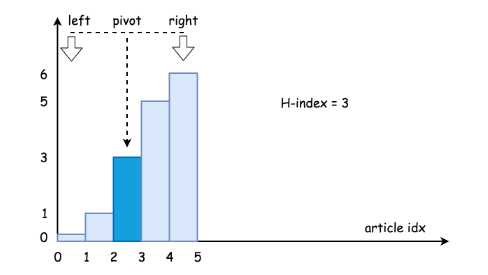

**算法：**

- 首先，我们先获取列表的中间元素，即 `citations[pivot]`，它将原始列表分成了两个子列表：``citations[0 : pivot - 1]`` 和 `citations[pivot + 1 : n]`。
- 然后比较 `n - pivot` 和 `citations[pivot]` 的值，二分搜索算法分为以下 3 种情况：
- 若 `citations[pivot] == n - pivot`：则我们找到了想要的元素。
- 若 `citations[pivot] < n - pivot`：由于我们想要的元素应该大于或等于 `n - pivot`，所以我们应该进一步搜索右边的子列表，即 `citations[pivot + 1 : n]`。
- 若 `citations[pivot] > n - pivot`：我们应该进一步搜索左边的子列表，即 `citations[0 : pivot-1]`。

与典型的二分搜索算法的一个小区别就是，我们返回的结果是 n - pivot，而不是所需元素的值。

### 复杂度分析

时间复杂度：$O(logN)$，由于使用了二分搜索算法。
空间复杂度：$O(1)$，这是一个常数空间的解决方法。

### c++实现

```c++
#include <iostream>
#include <vector>

using namespace std;

class Solution {
public:
    int hIndex(vector<int>& citations) {
        int size = citations.size();
        if (size == 0) return 0;
        int low = 0;
        int height = size - 1;

        while (low <= height)
        {
            int mid = low + (height - low) / 2;

            if (citations[mid] == size - mid)
                return size - mid;
            else if (citations[mid] > (size - mid))
                height = mid - 1;
            else
                low = mid + 1;
        }
        return (size - low);
    }
};

int main()
{
    Solution s;
    vector<int> citations = {0,1,3,5,6};
    cout << s.hIndex(citations) << endl;
}
```

### python实现

```python
class Solution:
    def hIndex(self, citations):
        """
        :type citations: List[int]
        :rtype: int
        """
        n = len(citations)
        if n < 1:
            return 0
        low = 0
        height = n - 1
        while low < height:
            mid = low + (height - low) // 2
            if citations[mid] == n-mid:
                return n-mid
            elif citations[mid] > n-mid:
                height = mid - 1
            else:
                low = mid + 1
        return n - low

if __name__ == "__main__":
    s = Solution()
    citations = [0,1,3,5,6]
    print(s.hIndex(citations))
```


## **[朋友圈](https://leetcode-cn.com/problems/friend-circles/)**

### 题目

班上有 *N* 名学生。其中有些人是朋友，有些则不是。他们的友谊具有是传递性。如果已知 A 是 B 的朋友，B 是 C 的朋友，那么我们可以认为 A 也是 C 的朋友。所谓的朋友圈，是指所有朋友的集合。

给定一个  N * N 的矩阵 M，表示班级中学生之间的朋友关系。如果$M[i][j] = 1$，表示已知第 i 个和 j 个学生互为朋友关系，否则为不知道。你必须输出所有学生中的已知的朋友圈总数。


**示例 1：**

```
输入：
[[1,1,0],
 [1,1,0],
 [0,0,1]]
输出：2 
解释：已知学生 0 和学生 1 互为朋友，他们在一个朋友圈。
第2个学生自己在一个朋友圈。所以返回 2 。
```

**示例 2：**

```
输入：
[[1,1,0],
 [1,1,1],
 [0,1,1]]
输出：1
解释：已知学生 0 和学生 1 互为朋友，学生 1 和学生 2 互为朋友，所以学生 0 和学生 2 也是朋友，所以他们三个在一个朋友圈，返回 1 。
```

**提示：**

- $1 <= N <= 200$
- $M[i][j] == 1$
- $M[i][j] == M[j][i]$

### DFS深度优先搜索

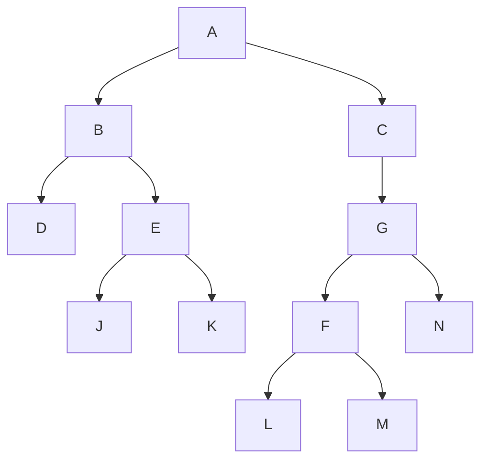

上面的顺序

```bash
从左边开始
1. A - B - D
2. E - J
3. K
左边结束

右边开始
1. A - C - G - F - L
2. M
3. N
```

```bash
3 个学生的关系，1为朋友，0不是朋友
	j 	j 	j
i [[1,  1,   0],
i  [1,  1,   1],
i  [0,  1,   1]]

A, B, C 三个朋友之间的关系,AA表示自己跟自己的关系
[[AA, AB,  AC],
 [BA, BB,  BC],
 [CA, CB,  CC]]
```

**leetCode 官方解析:**

给定的矩阵可以看成图的邻接矩阵。这样我们的问题可以变成无向图连通块的个数。为了方便理解，考虑如下矩阵：

```bash
M= [1 1 0 0 0 0
    1 1 0 0 0 0
    0 0 1 1 1 0
    0 0 1 1 0 0
    0 0 1 0 1 0
    0 0 0 0 0 1]
```


如果我们把 M 看成图的邻接矩阵，则图为：

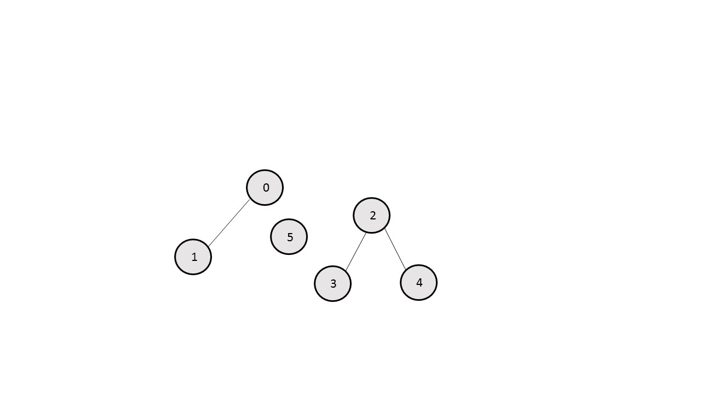

在这个图中，点的编号表示矩阵 M 的下标，*i* 和 *j* 之间有一条边当且仅当 $M[i][j]$为 1。

为了找到连通块的个数，一个简单的方法就是使用深度优先搜索，从每个节点开始，我们使用一个大小为 $N$ 的 $visited$ 数组（M 大小为 $N \times N$），这样 $visited[i]$ 表示第 i 个元素是否被深度优先搜索访问过。

我们首先选择一个节点，访问任一相邻的节点。然后再访问这一节点的任一相邻节点。这样不断遍历到没有未访问的相邻节点时，回溯到之前的节点进行访问。

任一图的深度优先搜索如下:

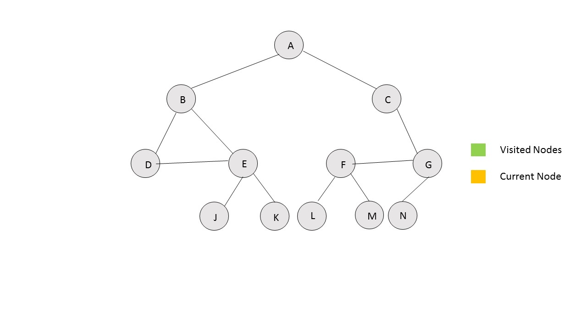 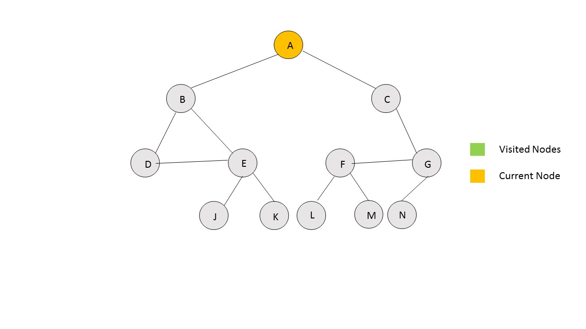

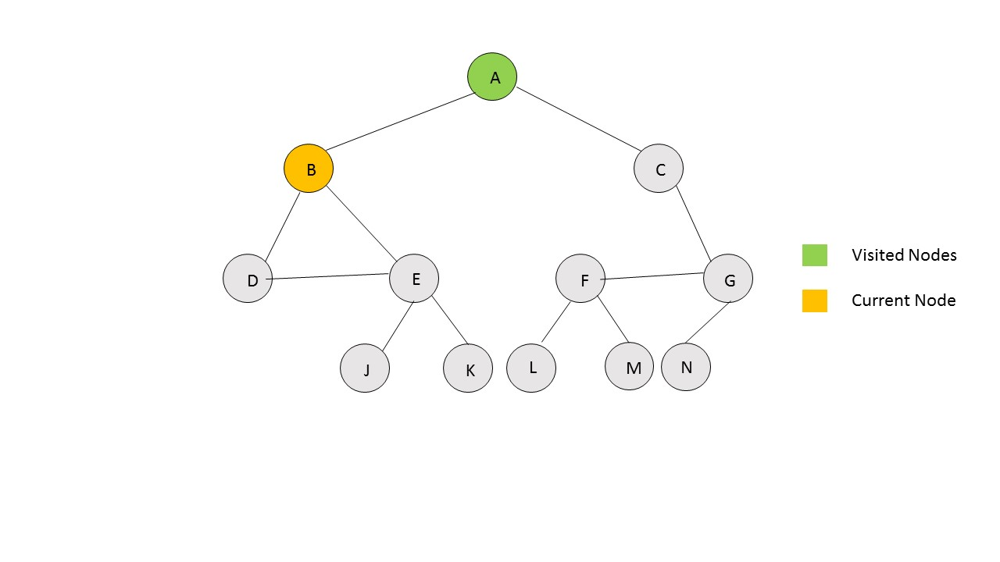  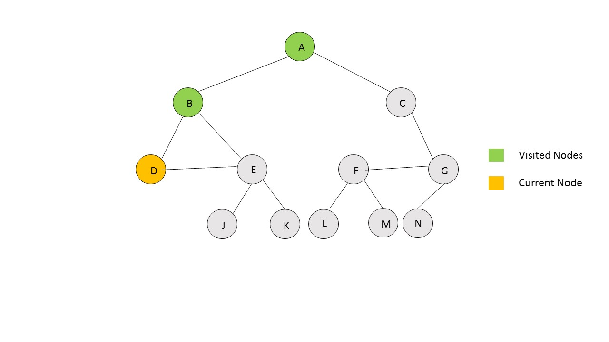


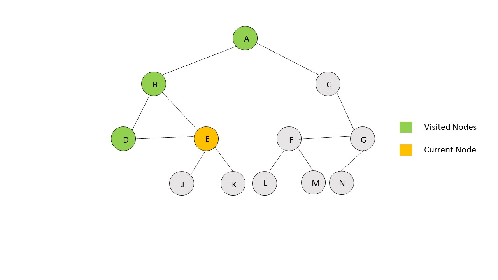 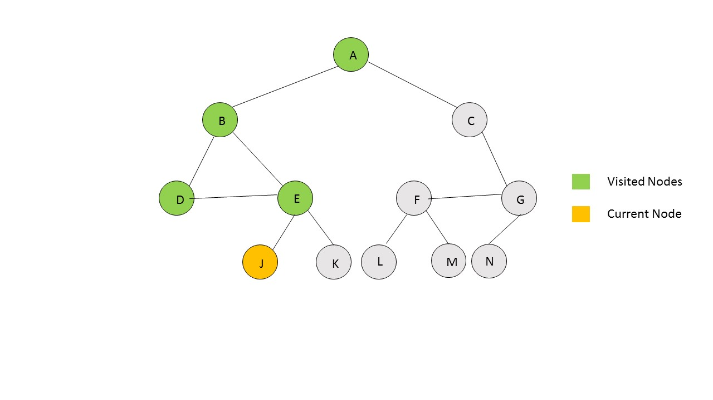

​					

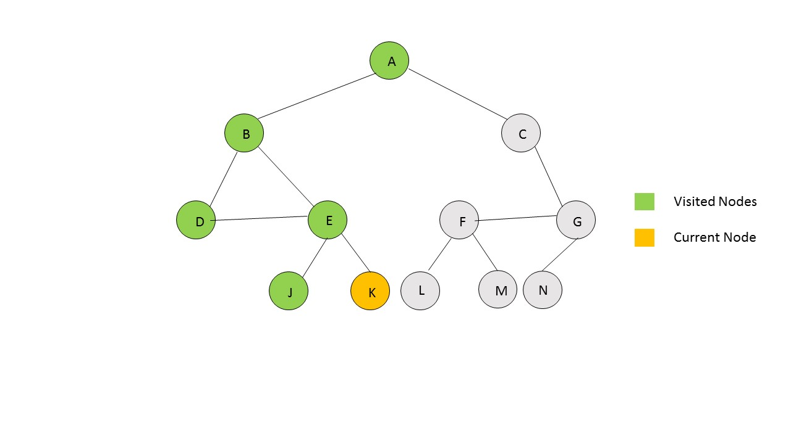 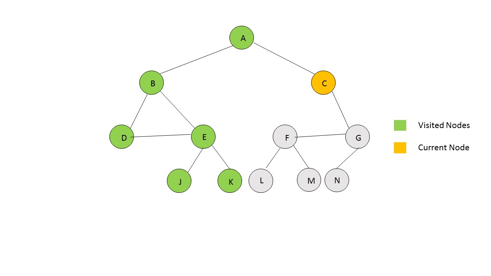


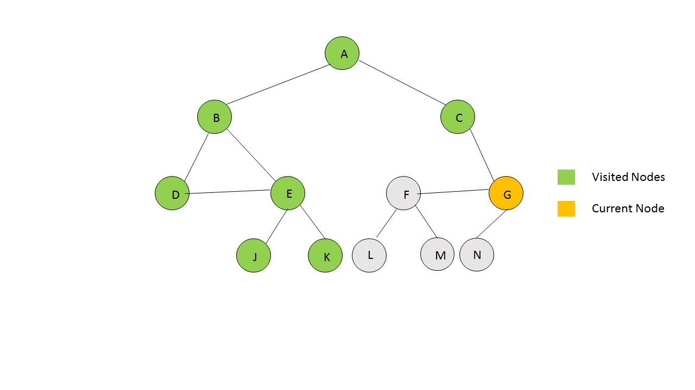 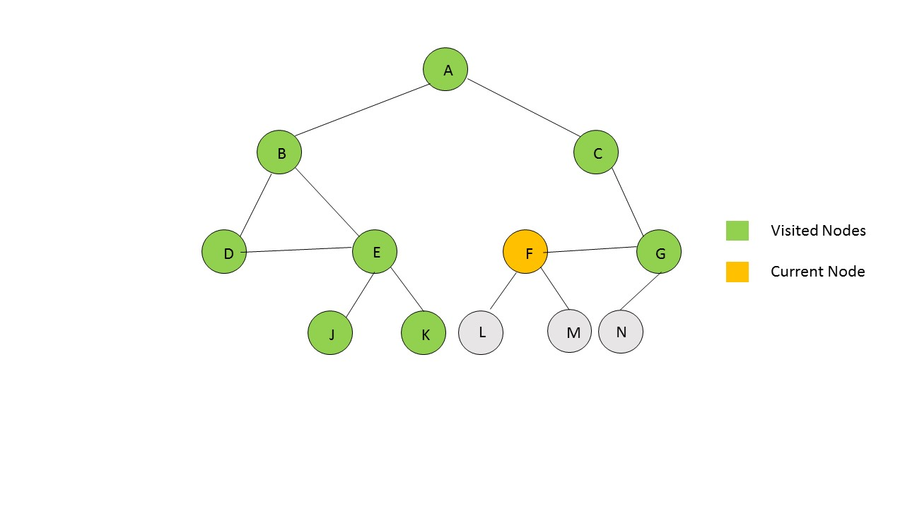	

​		

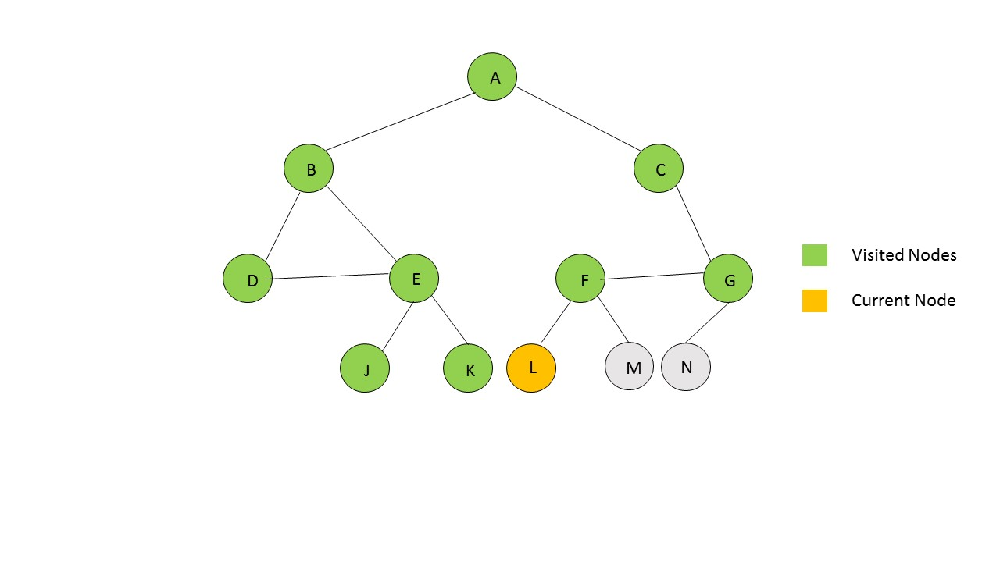 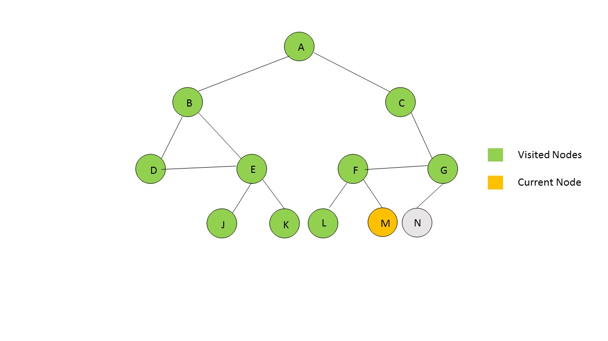


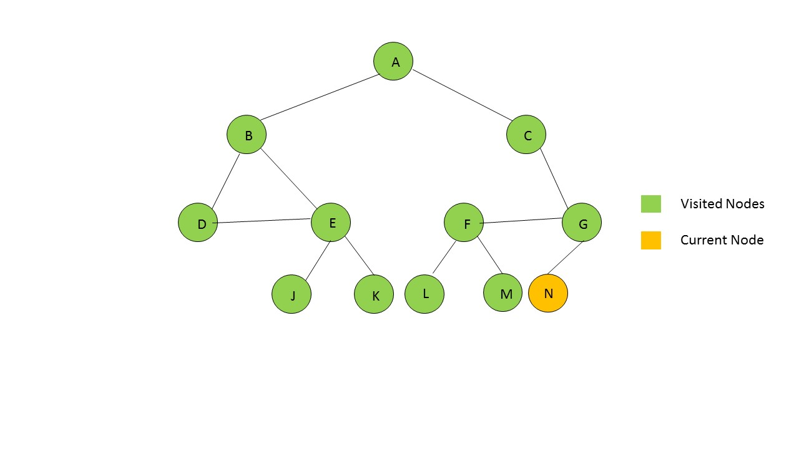 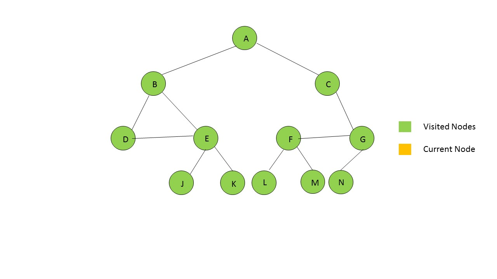

​	


### 复杂度分析

时间复杂度：$O(n^2)$，整个矩阵都要被遍历，大小为 $n^2$
空间复杂度：$O(n)，visited$ 数组的大小。


### C ++ 实现

```c++
#include <iostream>
#include <vector>

using namespace std;

class Solution {
    void dfs(vector<vector<int>>& M, vector<int> & visited, int i)
    {
        
		for(int j = 0; j < M.size(); ++j)
		{
			if(M[i][j] == 1 && visited[j] == 0)
			{
                visited[i] = 1;
				dfs(M, visited, j);
			}
		}
    }
public:
    int findCircleNum(vector<vector<int>>& M) {
        int count = 0;
        vector<int> visited(M.size());
        for(int i = 0; i < M.size(); ++i)
        {
        	if(visited[i] == 0)
        	{
        		dfs(M, visited, i);
        		++count;
        	}
        }
        return count;
    }
};

int main()
{
    Solution s;
    vector<vector<int>> M = {{1, 1, 0}, {1, 1, 1}, {0, 1, 1}};
    cout << s.findCircleNum(M) << endl;
    vector<vector<int>> M1 = {{1, 1, 0}, {1, 1, 0}, {0, 0, 1}};
    cout << s.findCircleNum(M1) << endl;
    return 0;
}
```

### python实现

```python
class Solution:
    def dfs(self, M, visited, i):
        for j in range(len(M)):
            if (M[i][j] == 1 and visited[j] == 0):
                visited[i] = 1
                self.dfs(M, visited, j)

    def findCircleNum(self, M) -> int:
        count = 0
        visited = [0] * len(M) * len(M)
        for i in range(len(M)):
            if (visited[i] == 0):
                self.dfs(M, visited, i)
                count += 1
        return count

if __name__ == "__main__":
    print(Solution().findCircleNum([[1,1,0], [1,1,1], [0,1,1]]))
    print(Solution().findCircleNum([[1,1,0], [1,1,0], [0,0,1]]))
```


## **[子集](https://leetcode-cn.com/problems/subsets/)**

### 题目

给定一组不含重复元素的整数数组 `nums`，返回该数组所有可能的子集（幂集）。

说明：解集不能包含重复的子集。

示例:

```
输入: nums = [1,2,3]
输出:
[
  [3],
  [1],
  [2],
  [1,2,3],
  [1,3],
  [2,3],
  [1,2],
  []
]
```

### 回溯算法 

当问题需要 **“回头”**, 要查找所有的解的时候，使用回溯算法。

满足结束条件，不是正确路径，走不通。要撤销选择，回退到上一个状态，继续尝试，直到找出所有解。

1. 画出递归树，找到状态变量（回溯函数的参数）
2. 依据需求，确定结束条件
3. 找出选择列表，与第一步紧密相关
4. 判断是否需要剪枝
5. 作出选择，递归调用，进入下一层
6. 撤销选择


#### 1. 递归数

子集，不含重复元素的整数数组，返回该数组所有可能的子集。

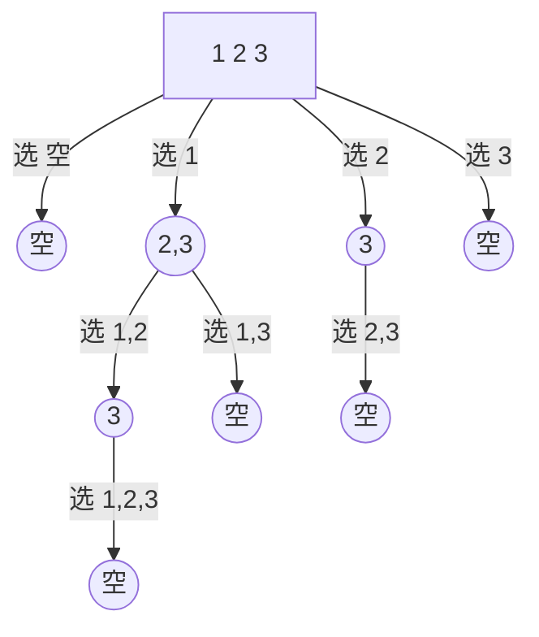

观察上图可得，选择列表里的数，文本箭头里的 选 1， 选 2 ， 选3 等

比如：

**选1 : ** 这条路径，后面的选择列表只有 "2、3"，

**选2 : ** 这条路径，后面只有 "3" 这个选择，

那么这个时候，就应该使用一个参数start，来标识当前的选择列表的起始位置。

也就是标识每一层的状态，因此被形象的称为"状态变量"。

上面的path就是上面，选1，选2，选1,2， 选2,3等。

```c++
//nums为题目中的给的数组
//path为路径结果，要把每一条 path 加入结果集
void backtrack(vector<int>nums,vector<int>&path,int start)
```

#### 2. 找结束条件

此题非常特殊，所有路径都应该加入结果集，所以不存在结束条件。或者说当 start 参数越过数组边界的时候，程序就自己跳过下一层递归了，因此不需要手写结束条件,直接加入结果集

```c++
// res为结果集，是全局变量vector<vector<int>>res,到时候要返回的
res.push_back(path);//把每一条路径加入结果集
```

#### 3. 找选择列表

在递归数图，中已经提到过了，子集问题的选择列表，是上一条选择路径之后的数,即

```c++
for(int i=start;i<nums.size();i++)
```

#### 4. 判断是否需要剪枝

从递归树中看到，路径没有重复的，也没有不符合条件的，所以不需要剪枝

#### 5. 撤销选择

```c++
path.pop_back();
```

#### 6.做出选择(即for 循环里面的)

```c++
void backtrack(vector<int>nums,vector<int>&path,int start)
{
    for(int i=start;i<nums.size();i++)
    {
    	//做出选择
        path.push_back(nums[i]);
        //递归进入下一层，注意i+1，标识下一个选择列表的开始位置，最重要的一步
        backtrack(nums,path,i+1);
    }
}
```


### C++实现

```c++
#include <iostream>
#include <vector>
using namespace std;

class Solution {
public:
    vector<vector<int>> res;
    vector<int> path;
    int cur = 0;
    void backtrack(vector<int>nums,vector<int>&path,int start)
    {
        res.push_back(path);
        for(int i=start;i<nums.size();i++)
        {
            path.push_back(nums[i]);
            backtrack(nums,path,i+1);
            path.pop_back();
        }
    }
    vector<vector<int>> subsets(vector<int>& nums) {
        backtrack(nums, path, cur);
        return res;
    }
};

int main()
{
    Solution s;
    vector<int> nums = {1, 2, 3};
    vector<vector<int>> res = s.subsets(nums);
    cout << res.size() << endl;

    for (int i = 0; res.size(); i++){
        for (int j = 0; j < res[i].size(); j++){
            cout << res[i][j] << endl;
        }
    }
    return 0;
}
```

### python 实现

```python
class Solution:
    def subsets(self, nums):
        res = []
        def backtrack(path, nums, start):
            res.append(path[:]) # 不加[:], 添加的是变量，最后会变成空
            for i in range(start, len(nums)):
                path.append(nums[i])
                backtrack(path, nums, i+1)
                path.pop()
        backtrack([], nums, 0)
        return res

if __name__ == "__main__":
    print(Solution().subsets([1,2,3]))
```

## **[岛屿数量](https://leetcode-cn.com/problems/number-of-islands/)**

### 题目

给你一个由 `'1'`（陆地）和 ` '0'`（水）组成的的二维网格，请你计算网格中岛屿的数量。

岛屿总是被水包围，并且每座岛屿只能由水平方向和 / 或竖直方向上相邻的陆地连接形成。

此外，你可以假设该网格的四条边均被水包围。

**示例 1：**

```bash
输入：grid = [
  ["1","1","1","1","0"],
  ["1","1","0","1","0"],
  ["1","1","0","0","0"],
  ["0","0","0","0","0"]
]
输出：1
```

**示例 2：**

```bash
输入：grid = [
  ["1","1","0","0","0"],
  ["1","1","0","0","0"],
  ["0","0","1","0","0"],
  ["0","0","0","1","1"]
]
输出：3
```

**提示：**

- $m == grid.length$ 
- $n == grid[i].length$ 
- $1 <= m, n <= 300 $
- $ grid[i][j] 的值为 '0' 或 '1' $


### 深度搜索

在某个 1 的竖直方向和水平方向，相邻为 1 的岛屿算是个一个岛屿

|   <font color='greed'>1</font>   |   <font color='greed'>1</font>   |               0                |                0                |                0                |
| :------------------------------: | :------------------------------: | :----------------------------: | :-----------------------------: | :-----------------------------: |
| <font color='greed'>**1**</font> | <font color='greed'>**1**</font> |               0                |                0                |                0                |
|                0                 |                0                 | <font color='red'>**1**</font> |                0                |                0                |
|                0                 |                0                 |               0                | <font color='blue'>**1**</font> | <font color='blue'>**1**</font> |

4个绿色 1，相邻1，所以只算一个岛屿。

红色 1 的，四个方向，左右上下，都没有1，算是一个岛屿。

两个相邻蓝色 1，只要四个方向再没有 1， 也算一个岛屿。

综上，总共有 3 个岛屿。


### 复杂度分析

时间复杂度：$O(MN)$，其中 $M$ 和 $N$ 分别为行数和列数。

空间复杂度：$O(MN)$，在最坏情况下，整个网格均为陆地，深度优先搜索的深度达到 $M N$。


### C++实现

```c++
#include <iostream>
#include <vector>

using namespace std;

class Solution{
private:
    void dfs(vector<vector<char> >& grid, int r, int c){
        int row = grid.size();
        int col = grid[0].size();

        grid[r][c] = '0';
        // 四个方向,左，右，上，下
        // 左,行数不变，列减一
        if (c - 1 > 0 && grid[r][c-1] == '1'){
            dfs(grid, r, c - 1);
        }

        // 右
        if (c + 1 < col && grid[r][c+1] == '1'){
            dfs(grid, r, c + 1);
        }

        // 上,列数不变，行减一
        if (r - 1 >= 0 && grid[r - 1][c] == '1'){
            dfs(grid, r - 1, c);
        }
        // 下
        if (r + 1 < row && grid[r + 1][c] == '1'){
            dfs(grid, r + 1, c);
        }
    }

public:
    int num_islands(vector<vector<char> > grid)
    {
        int row = grid.size();
        int col = grid[0].size();
        int num = 0;

        for (int i = 0; i < row; i++)
        {
            for (int j = 0; j < col; j++)
            {
                if (grid[i][j] == '1'){
                    num ++;
                    dfs(grid,i,j);
                }
            }
        }
        return num;
    }
};

int main()
{
    vector<vector<char> > grid = {
            {'1','1','1','1','0'},
            {'1','1','0','1','0'},
            {'1','1','0','0','0'},
            {'0','0','0','0','0'}
        };

    vector<vector<char> > grid1 = {
            {'1','1','0','0','0'},
            {'1','1','0','0','0'},
            {'0','0','1','0','0'},
            {'0','0','0','1','1'}
        };

    Solution s;
    cout << s.num_islands(grid) << endl;
    cout << s.num_islands(grid1) << endl;
    return 0;
}
```

### python 实现

```python
class Solution:
    def dfs(self, grid, r, c):
        grid[r][c] = 0
        nr, nc = len(grid), len(grid[0])
        for x, y in [(r - 1, c), (r + 1, c), (r, c - 1), (r, c + 1)]:
            if 0 <= x < nr and 0 <= y < nc and grid[x][y] == "1":
                self.dfs(grid, x, y)

    def numIslands(self, grid):
        nr = len(grid)
        if nr == 0:
            return 0
        nc = len(grid[0])

        num_islands = 0
        for r in range(nr):
            for c in range(nc):
                if grid[r][c] == "1":
                    num_islands += 1
                    self.dfs(grid, r, c)

        return num_islands

if __name__ == "__main__":
    grid = [
      ["1","1","1","1","0"],
      ["1","1","0","1","0"],
      ["1","1","0","0","0"],
      ["0","0","0","0","0"]
    ]
    s = Solution()
    print(s.numIslands(grid))
```


## **[分割数组的最大值](https://leetcode-cn.com/problems/split-array-largest-sum/)**

### 题目

给定一个非负整数数组和一个整数 m，你需要将这个数组分成 m 个非空的连续子数组。设计一个算法使得这 m 个子数组各自和的最大值最小。

**注意:**
数组长度 n 满足以下条件:

- $1 ≤ n ≤ 1000$
- $1 ≤ m ≤ min(50, n)$

示例:

```bash
输入:
nums = [7,2,5,10,8]
m = 2

输出:
18

解释:
一共有四种方法将nums分割为2个子数组。
其中最好的方式是将其分为[7,2,5] 和 [10,8]，
因为此时这两个子数组各自的和的最大值为18，在所有情况中最小。
```

### 二分查找 + 贪心

[使......最大值尽可能小] 是二分搜索题目常见的问法。

已知: 

1. 数组 `nums` 比如： [7,2,5,10,8]
2. 整数 `m` 比如 2，把 数组 `nums`拆分 2 份

上面拆分2份的话，例如 ( [7,2] 和 [5,10,8] )  或  ( [7,2,5]  和 [10, 8] ) 等等， 并且使得各自和的最大值，在所有等等中是最小的。


> 贪心地模拟分割的过程，从前到后遍历数组，用 sum 表示当前分割子数组的和，cur 表示已经分割出的子数组的数量（包括当前子数组），那么每当sum 加上当前值超过了 mid_sum，我们就把当前取的值作为新的一段分割子数组的开头，并将 cur 加 1。遍历结束后验证是否 cur 不超过 m。


用二分查找，一般先找出二分的上界和下界

二分的上界为数组 `nums` 中所有元素的和

下界为数组 `nums` 中所有元素的最大值


### 复杂度分析

时间复杂度：$O(n×log(sum−maxn))$，其中 $\textit{sum}$ 表示数组 $\textit{nums}$ 中所有元素的和，$\textit{maxn}$ 表示数组所有元素的最大值。每次二分查找时，需要对数组进行一次遍历，时间复杂度为 $O(n)$，因此总时间复杂度是 $O(n \times \log(\textit{sum}-\textit{maxn}))$。

空间复杂度： $O(1)$

### C++ 实现

```c++
#include <iostream>
#include <vector>

using namespace std;

class Solution {
public:
    bool check(int mid_num, vector<int>&nums, int m){
        int cur = 1;
        int total = 0;

        for (int i = 0; i < nums.size(); i++) {
            if ((nums[i] + total) > mid_num) {
                cur += 1;
                total = nums[i];
            }

            else{
                total += nums[i];
            }
        }
        return cur <= m;
    }

    int splitArray(vector<int>& nums, int m) {
        if (nums.size() < 1) return 0;
        int left = 0;
        int right = 0;
        for (int i = 0; i < nums.size(); i++){
            right += nums[i];
            if (left < nums[i])
                left = nums[i];
        }
        while (left <= right){
            int mid = (left + right) / 2;
            if (check(mid, nums, m)){
                right = mid - 1;
            }
            else{
                left = mid + 1;
            }
        }

        return left;
    }
};

int main()
{
    Solution s;
    vector<int> nums = {7, 2, 5, 10, 8};
    cout << s.splitArray(nums, 2) << endl;
}
```


### python 实现

```python
class Solution:
    def splitArray(self, nums, m):
        def check(mid_sum):
            cur = 1
            total = 0
            for num in nums:
                if total + num > mid_sum:
                    # 已经大于，total,得从下一次开始计算和
                    cur += 1
                    total = num
                else:
                    total += num
            return cur <= m

        left = max(nums)
        right = sum(nums)

        while left <= right:
            mid = (left + right) // 2
            if check(mid):
                right = mid - 1
            else:
                left = mid + 1
        return left
    
if __name__ == "__main__":
	s = Solution()
	nums = [7,2,5,10,8]
	print(s.splitArray(nums,2))
```


## **[地图分析](https://leetcode-cn.com/problems/as-far-from-land-as-possible/)**

### 题目

你现在手里有一份大小为 $N \times N$ 的 网格  `grid`，上面的每个 单元格 都用 `0` 和 `1` 标记好了。

其中 `0`  代表海洋，`1`  代表陆地，请你找出一个海洋单元格，这个海洋单元格到离它最近的陆地单元格的距离是最大的。

我们这里说的距离是「曼哈顿距离」 (Manhattan Distance）：`(x0, y0)`​ 和  `(x1, y1)​` 这两个单元格之间的距离是 ` ​|x0 - x1| + |y0 - y1|​` 。

如果网格上只有陆地或者海洋，请返回 -1。

**示例 1：**

|  1   |  0   |  1   |
| :--: | :--: | :--: |
|  0   |  0   |  0   |
|  1   |  0   |  1   |

```bash
输入：[[1,0,1],[0,0,0],[1,0,1]]
输出：2
解释： 
海洋单元格 (1, 1) 和所有陆地单元格之间的距离都达到最大，最大距离为 2。
```

**示例 2：**

|  1   |  0   |  0   |
| :--: | :--: | :--: |
|  0   |  0   |  0   |
|  0   |  0   |  0   |

```
输入：[[1,0,0],[0,0,0],[0,0,0]]
输出：4
解释： 
海洋单元格 (2, 2) 和所有陆地单元格之间的距离都达到最大，最大距离为 4。
```


提示：

- `1 <= grid.length == grid[0].length <= 100​`
- `grid[i][j] 不是 0,  就是 1`

### 动态规划方法 

单元格下标，可以看成二维向量坐标。求最大距离，

先知道距离计算公式:

$(x_0,y_0), (x_1,y_1)$ 这里两个坐标可以表示 (0,0) , (1,1)

坐标是坐标值，跟海洋 0 和陆地 1 不是同样的意义，两者不要混淆。

示例2的描述，海洋单元格（2,2）就是表示坐标值。下标从0开始，对应就是最下角的位置 0 

陆地就只有最上角的位置 1， 即坐标位置就是 (0, 0)

代入公式可得
$$
res = |x0 - x1| + |y0 - y1| = |0 - 2| + | 0 - 2| = 4
$$
最大距离为 4


「把陆地区域作为源点集、海洋区域作为目标点集，求最短路」的过程。我们知道对于每个海洋区域 (x, y)，离它最近的陆地区域到它的路径要么从上方或者左方来，要么从右方或者下方来。考虑做两次动态规划，第一次从左上到右下，第二次从右下到左上，记 f(x, y)为 (x, y) 距离最近的陆地区域的曼哈顿距离，则我们可以推出这样的转移方程：

第一阶段	
$$
f(x, y)=\left\{\begin{array}{ll}
0 & ,(x, y) \text { is land } \\
\min \{f(x-1, y), f(x, y-1)\}+1 & ,(x, y) \text { is ocean }
\end{array}\right.
$$


第二阶段


$$
f(x, y)=\left\{\begin{array}{ll}
0 & ,(x, y) \text { is land } \\
\min \{f(x+1, y), f(x, y+1)\}+1 & ,(x, y) \text { is ocean }
\end{array}\right.
$$
​	


我们初始化的时候把陆地的 `f` 值全部预置为 `0`，海洋的 ` f `全部预置为` INF`，做完两个阶段的动态规划后，我们在所有的不为零的 `f[i][j] ​`中比一个最大值即可，如果最终比较出的最大值为 `INF`，就返回 -1。

**思考：如果用 $f(x, y)$ 记录左上方的 DP 结果，$g(x, y)$ 记录右下方的DP结果可行吗？** 

答案是不可行。因为考虑距离点 $(x, y)$最近的点可能既不来自左上方，也不来自右下方，比如它来自右上方，这个时候，第二阶段我们就需要用到第一阶段的计算结果。


### 复杂度分析

时间复杂度：从代码不难看出，这个算法的过程就是四个双重`for` 循环，渐进时间复杂度为 $O(n^2)$。

空间复杂度：该算法使用了 `f `数组，渐进空间复杂度为 $O(n^2)$。

 

### c++ 实现

```c++
#include <iostream>
#include <vector>
using namespace std;

class Solution {
public:
    static constexpr int MAX_N = 100 + 5;
    static constexpr int INF = int(1E6);

    int f[MAX_N][MAX_N];
    int n;

    int maxDistance(vector<vector<int>>& grid) {
        this->n = grid.size();
        vector<vector<int>>& a = grid;

        for (int i = 0; i < n; ++i) {
            for (int j = 0; j < n; ++j) {
                f[i][j] = (a[i][j] ? 0 : INF);
            }
        }

        for (int i = 0; i < n; ++i) {
            for (int j = 0; j < n; ++j) {
                if (a[i][j]) {
                    continue;
                }
                if (i - 1 >= 0) {
                    f[i][j] = min(f[i][j], f[i - 1][j] + 1);
                }
                if (j - 1 >= 0) {
                    f[i][j] = min(f[i][j], f[i][j - 1] + 1);
                }
            }
        }

        for (int i = n - 1; i >= 0; --i) {
            for (int j = n - 1; j >= 0; --j) {
                if (a[i][j]) {
                    continue;
                }
                if (i + 1 < n) {
                    f[i][j] = min(f[i][j], f[i + 1][j] + 1);
                }
                if (j + 1 < n) {
                    f[i][j] = min(f[i][j], f[i][j + 1] + 1);
                }
            }
        }

        int ans = -1;
        for (int i = 0; i < n; ++i) {
            for (int j = 0; j < n; ++j) {
                if (!a[i][j]) {
                    ans = max(ans, f[i][j]);
                }
            }
        }

        return (ans == INF ? -1 : ans);
    }
};

int main()
{
    Solution s;
    vector<vector<int> > grid = {
        {1,0,1},
        {0,0,0},
        {1,0,1},
    };
    cout << s.maxDistance(grid) << endl;
    return 0;
}
```

### python 实现

```python
class Solution:
    def maxDistance(self, grid):
        INF = int(1E6)
        n = len(grid)
        f = [[0 for i in range(100+5)] for j in range(100+5)]
        a = grid.copy()

        for i in range(n):
            for j in range(n):
                f[i][j] = 0 if a[i][j] else INF

        for i in range(n):
            for j in range(n):
                if a[i][j]: continue
                if (i - 1 >= 0):
                    f[i][j] = min(f[i][j], f[i-1][j] + 1)
                if (j - 1 >= 0):
                    f[i][j] = min(f[i][j], f[i][j-1] + 1)

        for i in range(n-1,-1,-1):
            for j in range(n-1,-1,-1):
                if a[i][j]: continue

                if (i + 1 < n):
                    f[i][j] = min(f[i][j], f[i + 1][j] + 1)

                if (j + 1 < n):
                    f[i][j] = min(f[i][j], f[i][j+1] + 1)

        ans = -1
        for i in range(n):
            for j in range(n):
                if a[i][j] == 0:
                    ans = max(ans, f[i][j])

        return (ans if ans != INF else -1)


if __name__ == "__main__":
    grid = [[1,0,1],[0,0,0],[1,0,1]]
    print(Solution().maxDistance(grid))
```


## **[网格中的最短路径](https://leetcode-cn.com/problems/shortest-path-in-a-grid-with-obstacles-elimination/)**

### 题目

给你一个 `m * n` 的网格，其中每个单元格不是 `0`（空）就是 `1`（障碍物）。每一步，您都可以在空白单元格中上、下、左、右移动。

如果您 最多 可以消除 `k` 个障碍物，请找出从左上角 `(0, 0)` 到右下角 `(m-1, n-1) `的最短路径，并返回通过该路径所需的步数。如果找不到这样的路径，则返回 -1。

 

**示例 1：**

```
输入： 
grid = 
[[0,0,0],
 [1,1,0],
 [0,0,0],
 [0,1,1],
 [0,0,0]], 
k = 1
输出：6
解释：
不消除任何障碍的最短路径是 10。
消除位置 (3,2) 处的障碍后，最短路径是 6 。该路径是 (0,0) -> (0,1) -> (0,2) -> (1,2) -> (2,2) -> (3,2) -> (4,2).
```

**示例 2：**

```
输入：
grid = 
[[0,1,1],
 [1,1,1],
 [1,0,0]], 
k = 1
输出：-1
解释：
我们至少需要消除两个障碍才能找到这样的路径。
```


提示：

- `grid.length == m​`
- `grid[0].length == n​`
- `1 <= m, n <= 40​`
- `1 <= k <= m*n​`
- `grid[i][j] == 0 or 1​`
- `grid[0][0] == grid[m-1][n-1] == 0​`


### 广度优先搜索 + 队列

对于二维网格中的最短路问题，我们一般可以使用广度优先搜索 + 队列的方法解决。

本题中，玩家在移动时可以消除障碍物，这会导致网格的结构发生变化，看起来我们需要在广度优先搜索时额外存储网格的变化。但实际上，由于玩家在最短路中显然不会经过同一位置超过一次，因此最多消除 k 个障碍物等价于最多经过 k 个障碍物。

- 这样我们就可以使用三元组 `(x, y, rest)` $ 表示一个搜索状态，其中$ `(x, y) `表示玩家的位置，rest 表示玩家还可以经过 `rest` 个障碍物，它的值必须为非负整数。

- 对于当前的状态 `(x, y, rest)`，它可以向最多四个新状态进行搜索，即将玩家 `(x, y)` 向四个方向移动一格。

- 假设移动的方向为 `(dx, dy)`，那么玩家的新位置为 `(mx + dx, my + dy)`。

- 如果该位置为障碍物，那么新的状态为 `(mx + dx, my + dy, rest - 1)` $，否则新的状态为$ `(mx + dx, my + dy, rest)`。

- 我们从初始状态 `(0, 0, k)` 开始搜索，当我们第一次到达状态 `(m - 1, n - 1, k')`，其中 `k'` 是任意非负整数时，就得到了从左上角 `(0, 0)` 到右下角 `(m - 1, n - 1)` 且最多经过 `k` 个障碍物的最短路径。

  

此外，我们还可以对搜索空间进行优化。

注意到题目中 `k` 的上限为 `m * n`，但考虑一条从 `(0, 0)` 向下走到 `(m - 1, 0)` 再向右走到 `(m - 1, n - 1)` 的路径，它经过了 `m + n - 1` 个位置，其中起点 `(0, 0)` 和终点 `(m - 1, n - 1)` 没有障碍物，那么这条路径上最多只会有 `m + n - 3` 个障碍物。

因此我们可以将 k 的值设置为 `m + n - 3` 与其本身的较小值 `min(k, m + n - 3)`，将广度优先搜索的时间复杂度从 $ O(MNK)$ 降低至 $O(MN * \min(M + N, K))$


### 复杂度分析

时间复杂度：$O(MN * \min(M + N, K))。$

空间复杂度：$O(MN * \min(M + N, K))。$


### c++实现

```c++
struct Nagato {
    int x, y;
    int rest;
    Nagato(int _x, int _y, int _r): x(_x), y(_y), rest(_r) {}
};

class Solution {
private:
    static constexpr int dirs[4][2] = {{-1, 0}, {1, 0}, {0, -1}, {0, 1}};

public:
    int shortestPath(vector<vector<int>>& grid, int k) {
        int m = grid.size(), n = grid[0].size();
        if (m == 1 && n == 1) {
            return 0;
        }

        k = min(k, m + n - 3);
        bool visited[m][n][k + 1];
        memset(visited, false, sizeof(visited));
        queue<Nagato> q;
        q.emplace(0, 0, k);
        visited[0][0][k] = true;

        for (int step = 1; q.size() > 0; ++step) {
            int cnt = q.size();
            for (int _ = 0; _ < cnt; ++_) {
                Nagato cur = q.front();
                q.pop();
                for (int i = 0; i < 4; ++i) {
                    int nx = cur.x + dirs[i][0];
                    int ny = cur.y + dirs[i][1];
                    if (nx >= 0 && nx < m && ny >= 0 && ny < n) {
                        if (grid[nx][ny] == 0 && !visited[nx][ny][cur.rest]) {
                            if (nx == m - 1 && ny == n - 1) {
                                return step;
                            }
                            q.emplace(nx, ny, cur.rest);
                            visited[nx][ny][cur.rest] = true;
                        }
                        else if (grid[nx][ny] == 1 && cur.rest > 0 && !visited[nx][ny][cur.rest - 1]) {
                            q.emplace(nx, ny, cur.rest - 1);
                            visited[nx][ny][cur.rest - 1] = true;
                        }
                    }
                }
            }
        }
        return -1;
    }
};
```


### python 实现

```python
class Solution:
    def shortestPath(self, grid: List[List[int]], k: int) -> int:
        m, n = len(grid), len(grid[0])
        if m == 1 and n == 1:
            return 0
        
        k = min(k, m + n - 3)
        visited = set([(0, 0, k)])
        q = collections.deque([(0, 0, k)])

        step = 0
        while len(q) > 0:
            step += 1
            cnt = len(q)
            for _ in range(cnt):
                x, y, rest = q.popleft()
                for dx, dy in [(-1, 0), (1, 0), (0, -1), (0, 1)]:
                    nx, ny = x + dx, y + dy
                    if 0 <= nx < m and 0 <= ny < n:
                        if grid[nx][ny] == 0 and (nx, ny, rest) not in visited:
                            if nx == m - 1 and ny == n - 1:
                                return step
                            q.append((nx, ny, rest))
                            visited.add((nx, ny, rest))
                        elif grid[nx][ny] == 1 and rest > 0 and (nx, ny, rest - 1) not in visited:
                            q.append((nx, ny, rest - 1))
                            visited.add((nx, ny, rest - 1))
        return -1
```


## **[矩阵中的最长递增路径](https://leetcode-cn.com/problems/longest-increasing-path-in-a-matrix/)**

### 题目

给定一个整数矩阵，找出最长递增路径的长度。

对于每个单元格，你可以往上，下，左，右四个方向移动。 你不能在对角线方向上移动或移动到边界外（即不允许环绕）。

示例 1:

```
输入: nums = 
[
  [9,9,4],
  [6,6,8],
  [2,1,1]
] 
输出: 4 
解释: 最长递增路径为 [1, 2, 6, 9]。
```


示例 2:

```
输入: nums = 
[
  [3,4,5],
  [3,2,6],
  [2,2,1]
] 
输出: 4 
解释: 最长递增路径是 [3, 4, 5, 6]。注意不允许在对角线方向上移动。
```


### 记忆化深度优先搜索

将矩阵看成一个有向图，每个单元格对应图中的一个节点，如果相邻的两个单元格的值不相等，则在相邻的两个单元格之间存在一条从较小值指向较大值的有向边。问题转化成在有向图中寻找最长路径。

深度优先搜索是非常直观的方法。从一个单元格开始进行深度优先搜索，即可找到从该单元格开始的最长递增路径。对每个单元格分别进行深度优先搜索之后，即可得到矩阵中的最长递增路径的长度。

但是如果使用朴素深度优先搜索，时间复杂度是指数级，会超出时间限制，因此必须加以优化。

朴素深度优先搜索的时间复杂度过高的原因是进行了大量的重复计算，同一个单元格会被访问多次，每次访问都要重新计算。由于同一个单元格对应的最长递增路径的长度是固定不变的，因此可以使用记忆化的方法进行优化。用矩阵 $memo$ 作为缓存矩阵，已经计算过的单元格的结果存储到缓存矩阵中。

使用记忆化深度优先搜索，当访问到一个单元格 $(i,j)$  时，如果$memo[i][j]\neq0$，说明该单元格的结果已经计算过，则直接从缓存中读取结果，如果$memo[i][j]=0$ ，说明该单元格的结果尚未被计算过，则进行搜索，并将计算得到的结果存入缓存中。

遍历完矩阵中的所有单元格之后，即可得到矩阵中的最长递增路径的长度。


### 复杂度分析

时间复杂度：$O(mn)$，其中 $m$ 和 $n$ 分别是矩阵的行数和列数。深度优先搜索的时间复杂度是 $O(V+E)$，其中 $V$ 是节点数，$E$ 是边数。在矩阵中，$O(V)=O(mn)$，$O(E)\approx O(4mn) = O(mn)$)。

空间复杂度：$O(mn)$，其中 $m$ 和 $n$ 分别是矩阵的行数和列数。空间复杂度主要取决于缓存和递归调用深度，缓存的空间复杂度是 $O(mn)$，递归调用深度不会超过 $mn$。


### c++ 实现

```c++
class Solution {
public:
    static constexpr int dirs[4][2] = {{-1, 0}, {1, 0}, {0, -1}, {0, 1}};
    int rows, columns;

    int longestIncreasingPath(vector< vector<int> > &matrix) {
        if (matrix.size() == 0 || matrix[0].size() == 0) {
            return 0;
        }
        rows = matrix.size();
        columns = matrix[0].size();
        auto memo = vector< vector<int> > (rows, vector <int> (columns));
        int ans = 0;
        for (int i = 0; i < rows; ++i) {
            for (int j = 0; j < columns; ++j) {
                ans = max(ans, dfs(matrix, i, j, memo));
            }
        }
        return ans;
    }

    int dfs(vector< vector<int> > &matrix, int row, int column, vector< vector<int> > &memo) {
        if (memo[row][column] != 0) {
            return memo[row][column];
        }
        ++memo[row][column];
        for (int i = 0; i < 4; ++i) {
            int newRow = row + dirs[i][0], newColumn = column + dirs[i][1];
            if (newRow >= 0 && newRow < rows && newColumn >= 0 && newColumn < columns && matrix[newRow][newColumn] > matrix[row][column]) {
                memo[row][column] = max(memo[row][column], dfs(matrix, newRow, newColumn, memo) + 1);
            }
        }
        return memo[row][column];
    }
};
```

### python 实现

```python
class Solution:
    
    DIRS = [(-1, 0), (1, 0), (0, -1), (0, 1)]

    def longestIncreasingPath(self, matrix: List[List[int]]) -> int:
        if not matrix:
            return 0
        
        @lru_cache(None)
        def dfs(row: int, column: int) -> int:
            best = 1
            for dx, dy in Solution.DIRS:
                newRow, newColumn = row + dx, column + dy
                if 0 <= newRow < rows and 0 <= newColumn < columns and matrix[newRow][newColumn] > matrix[row][column]:
                    best = max(best, dfs(newRow, newColumn) + 1)
            return best

        ans = 0
        rows, columns = len(matrix), len(matrix[0])
        for i in range(rows):
            for j in range(columns):
                ans = max(ans, dfs(i, j))
        return ans
```


## **[无重复字符的最长子串](https://leetcode-cn.com/problems/longest-substring-without-repeating-characters/)**

### 题目

给定一个字符串，请你找出其中不含有重复字符的 **最长子串** 的长度。

示例 1:

```
输入: "abcabcbb"
输出: 3 
解释: 因为无重复字符的最长子串是 "abc"，所以其长度为 3。
```

示例 2:

```
输入: "bbbbb"
输出: 1
解释: 因为无重复字符的最长子串是 "b"，所以其长度为 1。
```

示例 3:

```
输入: "pwwkew"
输出: 3
解释: 因为无重复字符的最长子串是 "wke"，所以其长度为 3。
     请注意，你的答案必须是 子串 的长度，"pwke" 是一个子序列，不是子串。
```

### 滑动窗口

我们不妨以示例一中的字符串  $abcabcbb$ 为例，找出 **从每一个字符开始的，不包含重复字符的最长子串，** 那么其中最长的那个字符串即为答案。对于示例一中的字符串，我们列举出这些结果，其中括号中表示选中的字符以及最长的字符串：

- 以 $(a)bcabcbb$ 开始的最长字符串为 $ (abc)abcbb $；
- 以 $ a(b)cabcbb $ 开始的最长字符串为 $a(bca)bcbb $；
- 以 $ ab(c)abcbb$ 开始的最长字符串为 $ ab(cab)cbb $；
- 以 $ abc(a)bcbb $ 开始的最长字符串为 $ abc(abc)bb $；
- 以 $abca(b)cbb $ 开始的最长字符串为 $abca(bc)bb$；
- 以 $abcab(c)bb$ 开始的最长字符串为 $ abcab(cb)b$；
- 以 $ abcabc(b)b$ 开始的最长字符串为 $abcabc(b)b$；
- 以 $abcabcb(b)$ 开始的最长字符串为 $abcabcb(b)$ 。

发现了什么？如果我们依次递增地枚举子串的起始位置，那么子串的结束位置也是递增的！

这里的原因在于，假设我们选择字符串中的第  k 个字符作为起始位置，并且得到了不包含重复字符的最长子串的结束位置为 $rk $。

那么当我们选择第 $k+1$ 个字符作为起始位置时，首先从 $ k+1 $  到 $rk$  的字符显然是不重复的，并且由于少了原本的第 k 个字符，我们可以尝试继续增大 $rk$ ，直到右侧出现了重复字符为止。

这样以来，我们就可以使用「滑动窗口」来解决这个问题了：

- 我们使用两个指针表示字符串中的某个子串（的左右边界）。其中左指针代表着上文中「枚举子串的起始位置」，而右指针即为上文中的  $ rk $;

- 在每一步的操作中，我们会将左指针向右移动一格，表示**我们开始枚举下一个字符作为起始位置，** 然后我们可以不断地向右移动右指针，但需要保证这两个指针对应的子串中没有重复的字符。在移动结束后，这个子串就对应着**以左指针开始的，不包含重复字符的最长子串。**我们记录下这个子串的长度；

- 在枚举结束后，我们找到的最长的子串的长度即为答案。

**判断重复字符**

在上面的流程中，我们还需要使用一种数据结构来判断  **是否有重复的字符，** 常用的数据结构为哈希集合（即 C++ 中的 std::unordered_set，Python 中的 set）。在左指针向右移动的时候，我们从哈希集合中移除一个字符，在右指针向右移动的时候，我们往哈希集合中添加一个字符。


### 复杂度分析

- 时间复杂度：$ O(N) $，其中 $N$ 是字符串的长度。左指针和右指针分别会遍历整个字符串一次。

- 空间复杂度：$O(|\Sigma|)$，其中 $\SigmaΣ$ 表示字符集（即字符串中可以出现的字符），$|\Sigma|$ 表示字符集的大小。在本题中没有明确说明字符集，因此可以默认为所有 ASCII 码在 [0, 128)[0,128) 内的字符，即 $|\Sigma| = 128$ 。我们需要用到哈希集合来存储出现过的字符，而字符最多有 $|\Sigma|$ 个，因此空间复杂度为 $O(|\Sigma|)$。


### C++ 实现

```c++
#include <iostream>
#include <string>
#include <unordered_set>

using namespace std;

class Solution{
public:
    int lengthOfLongestSubstring(string s) {
        if (s.size() < 1) return 0;
        int n = s.size();
        // 哈希集合，记录每个字符是否出现过
        unordered_set<char> uset;

        // 右指针，初始值为 -1，相当于我们在字符串的左边界的左侧，还没有开始移动
        int rk = -1;
        int res = 0;
         // 枚举左指针的位置，初始值隐性地表示为 -1
        for (int k = 0; k < n; ++k){
            if ( k != 0){
                // 移动左指针,移除一个字符
                uset.erase(s[k - 1]);
            }

            
            while ( (rk+1 < n) && !uset.count(s[rk+1]) ){
                // 不断地移动右指针
                uset.emplace(s[rk+1]);
                ++ rk;
            }
            // 第 i 到 rk 个字符是一个极长的无重复字符子串
            res = max(res, rk - k + 1);
        }
        return res;
    }
};


int main()
{
    string s = "abcabcbb";
    Solution solution;
    cout << solution.lengthOfLongestSubstring(s) << endl;
}
```


### python 实现

```python
class Solution:
    def lengthOfLongestSubstring(self, s) -> int:
        # 哈希集合，记录每个字符是否出现过
        occ = set()
        n = len(s)
        # 右指针，初始值为 -1，相当于我们在字符串的左边界的左侧，还没有开始移动
        rk, ans = -1, 0
        for i in range(n):
            if i != 0:
                # 左指针向右移动一格，移除一个字符
                occ.remove(s[i - 1])
            while rk + 1 < n and s[rk + 1] not in occ:
                # 不断地移动右指针
                occ.add(s[rk + 1])
                rk += 1
            # 第 i 到 rk 个字符是一个极长的无重复字符子串
            ans = max(ans, rk - i + 1)
        return ans
if __name__ == "__main__":
    s = Solution() 
    print(s.lengthOfLongestSubstring("abcabcbb"))
```


## **[整数替换](https://leetcode-cn.com/problems/integer-replacement/)**

### 题目

给定一个正整数 `n` ，你可以做如下操作：

1. 如果 `n` 是偶数，则用 `n / 2`替换 `n` 。
2. 如果 `n` 是奇数，则可以用 `n + 1`或`n - 1`替换 `n` 。

`n` 变为 `1` 所需的最小替换次数是多少？

示例 1:

```
输入：n = 8
输出：3
解释：8 -> 4 -> 2 -> 1
```

示例 2：

```
输入：n = 7
输出：4
解释：7 -> 8 -> 4 -> 2 -> 1
或 7 -> 6 -> 3 -> 2 -> 1
```

示例 3：

```
输入：n = 4
输出：2
```

**提示：**

- 1 <= n <= $2^{31}$ - 1


### 递归方法

依据题目本身

1. 如果 `n` 是偶数，则用 `n / 2`替换 `n` 。
2. 如果 `n` 是奇数，则可以用 `n + 1`或`n - 1`替换 `n` 。

有一个加一个，递归循环使用，结束条件就是末尾 等于 1

### C++ 实现

```c++
#include <iostream>
#include <limits.h>

using namespace std;

class Solution
{
public:
    int integerReplacement(int n) {
        if(n == 1) return 0;
        if (n == INT_MAX) return 32;
        if((n&1)==0){
            return 1 + integerReplacement(n/2);
        }else{
            return 1 + min(integerReplacement(n+1), integerReplacement(n-1));
        }
    }
};

int main()
{
    Solution s;
    cout << s.integerReplacement(8) << endl;
}
```

### python 实现

```python
import sys
class Solution:
    def integerReplacement(self, n) -> int:
        if (n == 1): return 0
        if (n == sys.maxsize): return 32
        if (n & 1 == 0):
            return 1 + self.integerReplacement(n//2)
        else:
            return 1 + min(self.integerReplacement(n + 1), self.integerReplacement(n-1))

if __name__ == "__main__":
    s = Solution()
    print(s.integerReplacement(8))
```

